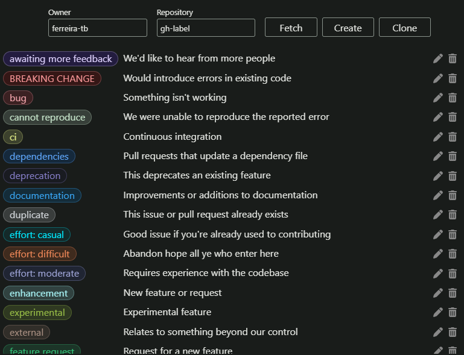

# gh-label

<div style="text-align: center;">
  
</div>

Clone this repository and run the following commands to build the app:

```bash
cargo install tauri-cli
pnpm install
pnpm run build
```

The built app can be found in the `src-tauri/target/release` directory.

It's also possible to run the app without building it:

```bash
pnpm run dev
```

## Prerequisites

- [GitHub CLI](https://cli.github.com/)
- [Rust](https://www.rust-lang.org/tools/install)
- [Tauri](https://tauri.app/v1/guides/getting-started/prerequisites)

You must make sure that you have the GitHub CLI installed and authenticated. You can authenticate with the following command:

```bash
gh auth login
```

For more information, see the [GitHub CLI documentation](https://cli.github.com/manual/gh_auth_login).

Rust and [Tauri](https://tauri.app/v1/guides/) are only required **before** building the app with `pnpm run build`. After that, you can run it without them.

## License

[MIT](https://raw.githubusercontent.com/ferreira-tb/gh-label/main/LICENSE)

Copyright (c) 2024 Andrew Ferreira
